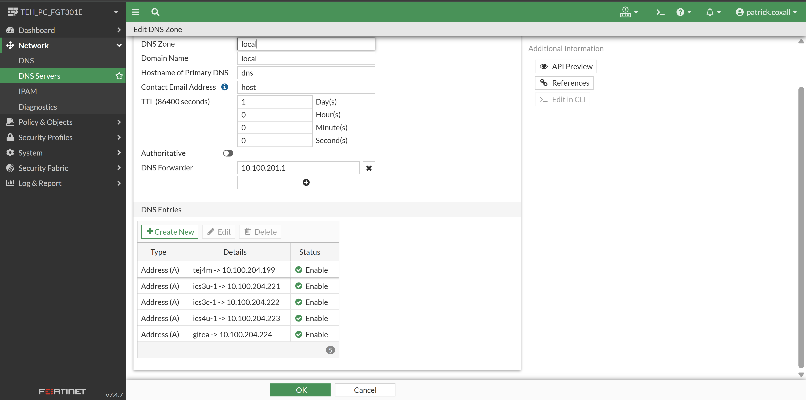

# Firewall Setup

## DNS

- set the naem you want for each IP address of a service you will be creating
  - for example, Coder IDE for ics3u-1, then:
    - `ics3u-1.local` for 10.100.204.221

- this is important to have them in advance, so that you do not use ip address and then have to change them back afterwards.

- it is optional and you could just run everything with IP addresses, but it is much easier to remember names!

